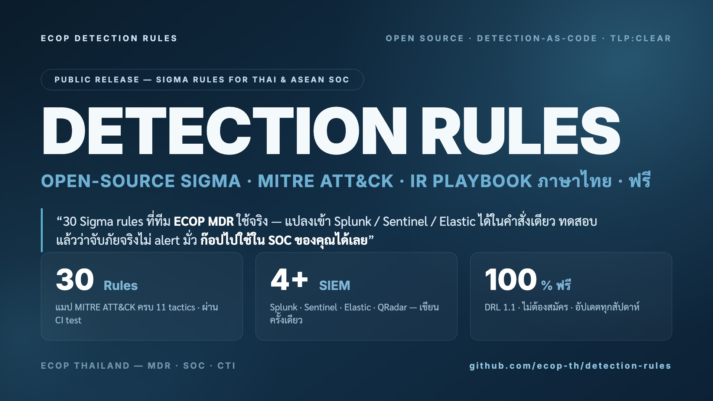

<div align="center">



# ECOP Detection Rules

### ภัยที่เห็นไม่ได้ คือภัยที่หยุดไม่ได้ — detection rules ฟรี เพื่อให้ SOC ไทยเห็นก่อน

**Sigma rules · Sysmon config · IR playbooks** — แมป MITRE ATT&CK ครบ · ผ่าน CI · สองภาษา 🇹🇭/🇬🇧
ก๊อปไปวางใน SIEM ของคุณได้เลย **ฟรี ไม่ต้องสมัคร ไม่ต้องกรอกฟอร์ม**

[](https://github.com/ecop-th/detection-rules/actions/workflows/sigma-test.yml)
[](https://github.com/ecop-th/detection-rules/actions/workflows/secret-scan.yml)
[](LICENSE)


⭐ **ถ้ามีประโยชน์กับ SOC ของคุณ ฝาก Star ไว้ติดตาม update รายเดือนด้วยนะครับ** ⭐

</div>

---

## 📊 At a glance

<div align="center">

<!-- STATS:START — auto-generated, อย่าแก้มือ -->
| 🎯 **33** | 🗺️ **11** | 🛰️ **7** | ⚡ **48 ชม.** | 🇹🇭 **2 ภาษา** |
|:---:|:---:|:---:|:---:|:---:|
| detection rules | ATT&CK tactics | telemetry sources | emerging-threat SLA | ไทย + อังกฤษ |
<!-- STATS:END -->

</div>

> ครอบคลุมตั้งแต่ **ผู้บุกรุกเข้ามา → ขโมย credential → เคลื่อนตัว → ปล่อย ransomware → ลบหลักฐาน**
> Curated & reviewed โดยทีม **ECOP MDR** — รวม rule ที่เจาะภัยคนไทยโดยเฉพาะใน [`sigma/thailand/`](sigma/thailand/)

---

## ⚡ Quick start — 30 วินาที

```bash
# 1) ติดตั้งตัวแปลง (ครั้งเดียว)
pip install sigma-cli

# 2) clone repo
git clone https://github.com/ecop-th/detection-rules.git && cd detection-rules

# 3) แปลง rule → query ของ SIEM ที่คุณใช้ แล้วเอาไปวางตั้ง alert ได้เลย
sigma convert -t splunk    sigma/finance/proc_creation_win_lsass_dump_comsvcs.yml   # Splunk
sigma convert -t sentinel  sigma/finance/proc_creation_win_lsass_dump_comsvcs.yml   # Microsoft Sentinel
sigma convert -t elasticsearch sigma/finance/proc_creation_win_lsass_dump_comsvcs.yml  # Elastic
```

> 💡 **repo นี้ไม่ใช่โปรแกรมที่ต้องติดตั้ง** — มันคือ "ตำราสูตรตรวจจับ" คุณเอา rule ไปแปลงเป็น query
> แล้ววางใน SIEM ของคุณเอง ของที่ใช้จริงคือ *query ที่แปลงออกมา* → [วิธีใช้แบบละเอียด](#-เข้ามาแล้วต้องทำอะไร)

> 🔄 **อยากรับ rule ใหม่อัตโนมัติ?** ตั้ง `git pull` รายคืน หรือกด Watch → Releases —
> ดู [วิธีตั้ง auto-update](docs/keeping-rules-updated.md)

---

## 🗺️ Coverage map — เราตรวจจับอะไรได้บ้าง

<!-- COVERAGE:START — auto-generated, อย่าแก้มือ -->
ครอบ **11 จาก 14 ATT&CK tactics** — เน้นจุดที่ attacker ในภูมิภาคนี้ใช้จริง:

| Tactic | Rules | ตัวอย่างที่จับได้ |
|---|:---:|---|
| 📌 Persistence | 8 | Run key, scheduled task, service, Azure AD admin role |
| ▶️ Execution | 6 | PowerShell encoded, WMIC, **Office macro phishing** |
| 🚪 Initial Access | 5 | RDP เปิดออกเน็ต, SQLi, path traversal, **Log4Shell** |
| 🥷 Defense Evasion | 5 | mshta, regsvr32 (Squiblydoo), ล้าง event log, ปิด MFA |
| 📡 Command & Control | 4 | LOLBin ต่อออกเน็ต, C2 ports, DNS แปลก |
| 📤 Exfiltration | 3 | SMB ออกนอก, **inbox forwarding (BEC)**, mailbox forward |
| 🔑 Credential Access | 3 | **LSASS dump**, NTDS.dit, Kerberoasting |
| 📦 Collection | 2 | M365 mail forwarding rules |
| ⬆️ Privilege Escalation | 2 | service creation, Azure AD role |
| ↔️ Lateral Movement | 2 | **PsExec**, WMIC remote |
| 💥 Impact | 1 | **ลบ shadow copy (ransomware)** |
<!-- COVERAGE:END -->

📂 จัดกลุ่มตาม **sector** (finance / web / windows) และ **telemetry** (endpoint · network · firewall · cloud)

---

## 🇹🇭 ทำไมต้อง repo นี้ — ไม่ได้มาแข่ง SigmaHQ

มี [SigmaHQ](https://github.com/SigmaHQ/sigma) ระดับโลกอยู่แล้ว เรามาเติม **จุดที่ของระดับโลกมองไม่เห็น**:

| | repo นี้ให้อะไรเพิ่ม |
|---|---|
| 🇹🇭 **rule ที่เจาะคนไทยจริง** | [`sigma/thailand/`](sigma/thailand/) — โดเมนปลอมแบงก์ไทย, LINE ส่งมัลแวร์, ไฟล์ลวงชื่อภาษาไทย (กำลังทยอยเพิ่ม) |
| 🌏 **Playbook ภาษาไทยใช้ได้จริง** | บอกขั้นตอนรับมือ อ้างอิง PDPA / เกณฑ์ ธปท. ไม่ใช่แค่แปลคำ |
| ⚡ **Emerging-threat SLA 48 ชม.** | มี CVE/campaign ดัง → ออก detection ใน [`emerging-threats/`](emerging-threats/) ทันที |
| 🎭 **Threat-actor mapping** | โยง rule → กลุ่ม APT (Lazarus, APT41, FIN7) ใน [`threat-actors/`](threat-actors/) |
| ✅ **ทดสอบจริง** | ทุก rule ผ่าน `sigma-cli` + lint; rule สำคัญมี **behaviour test** → [ดูหลักฐาน](docs/proof-it-works.md) |

---

## 📖 เข้ามาแล้วต้องทำอะไร?

เลือกวิธีตามความจริงจัง — มี 3 แบบ:

| แบบ | ทำยังไง | เหมาะกับ |
|---|---|---|
| 🟢 **ง่ายสุด** | เปิดไฟล์ `.yml` ที่อยากได้ → กดปุ่ม **Copy** มุมขวาบน | มาลองครั้งแรก เอา rule เดียว |
| 🟡 **กลาง** | กดปุ่มเขียว **`< > Code` → Download ZIP** | อยากได้ทั้งชุด |
| 🟣 **จริงจัง** | `git clone` แล้ว `git pull` รับ update รายเดือน | ทีม SOC ที่ใช้ต่อเนื่อง |

```text
เลือก rule  →  sigma convert  →  วาง query ใน SIEM  →  Save as Alert  →  ✅ เสร็จ
                                                              │
                                            alert ดัง → เปิด playbooks/ ดูวิธีรับมือต่อ
```

---

## 📂 โครงสร้าง repo

```
sigma/
├── finance/        💰 ธนาคาร/การเงิน — LSASS, NTDS, Kerberoast, PsExec
├── web/            🌐 webshell, SQLi, path traversal, IIS shell
├── windows/        🪟 endpoint LOLBin / cred access (EDR telemetry)
├── network/        🛰️ dns_query · network_connection (EDR-fed)
├── firewall/       🔥 RDP/SMB/C2 ports
├── m365/           ☁️ Microsoft 365 / Azure AD (cloud audit)
└── thailand/       🇹🇭 ภัยที่เจาะคนไทยจริง — โดเมนปลอมแบงก์ไทย, LINE, ไฟล์ลวงชื่อไทย

emerging-threats/   ⚡ detection ตอบ CVE ใหม่ภายใน 48 ชม. (เช่น Log4Shell)
threat-actors/      🎭 mapping: rule → กลุ่ม APT
playbooks/          📖 IR playbook ต่อ rule (TH/EN)
sysmon/             🛠️ ECOP Sysmon baseline
tests/              🧪 sample logs (positive/negative)
```

> 💡 **EDR rules อยู่ไหน?** `windows/` (process_creation) + `network/` คือ EDR telemetry อยู่แล้ว
> — EDR เป็น "แหล่ง log" ไม่ใช่ rule แยกประเภท

---

## ✅ คุณภาพมาก่อนปริมาณ

เรายอมมี rule น้อยแต่ดี — **มาตรฐานบังคับสำหรับ rule ทุกตัว:**

`sigma-cli check` &nbsp;•&nbsp; แมป **MITRE ATT&CK** &nbsp;•&nbsp; มี `falsepositives` จากของจริง &nbsp;•&nbsp; rule `high`/`critical` มี playbook

> rule เดียวที่ทำให้ SOC คนอื่น alert ท่วม ทำลายความน่าเชื่อถือมากกว่าการไม่มี rule นั้นเลย

🔬 **อยากเห็นว่าใช้ได้จริง?** rule สำคัญมี **behaviour test** (positive ต้อง MATCH / negative ต้อง NO MATCH) รันใน CI ทุก push — ดู [Proof it works](docs/proof-it-works.md)
> 📊 *ความโปร่งใส: ตอนนี้ ~9 rules มี behaviour test แล้ว กำลังทยอยเพิ่มให้ครบทุกตัว — rule ที่เหลือผ่าน syntax + lint ครบ*

---

## 🤝 อยากมีส่วนร่วม

- 🌱 มือใหม่? เริ่มที่ issue ป้าย [`good first rule`](https://github.com/ecop-th/detection-rules/labels/good%20first%20rule) — เรายินดี mentor
- 🐞 เจอ false positive? เปิด [issue](.github/ISSUE_TEMPLATE/false_positive.md) ได้เลย feedback แบบนี้มีค่ามาก
- 📝 อยากส่ง rule? อ่าน [CONTRIBUTING.md](CONTRIBUTING.md) (มี data-handling rules — ห้ามเอา log ลูกค้าขึ้น)

> ทุก rule ใส่ชื่อผู้เขียน → เป็น **portfolio สาธารณะ** ของคุณติดแบรนด์ ECOP

---

## 🙏 Acknowledgements / เครดิต

ยืนบนไหล่ของชุมชน detection — เราอ้างอิงและให้เครดิต:
- [SigmaHQ](https://github.com/SigmaHQ/sigma) — มาตรฐาน Sigma และแรงบันดาลใจของ generic detection หลายตัว
- [MITRE ATT&CK](https://attack.mitre.org/) — กรอบการแมป technique
- [LOLBAS](https://lolbas-project.github.io/) — ข้อมูล living-off-the-land binaries

> rule ทั้งหมด **curated และ review โดยทีม ECOP MDR analysts** (CREST / OSCP / CISSP)
> rule ที่ปรับ/อ้างอิงจากชุมชนจะระบุที่มาในฟิลด์ `references` ของแต่ละไฟล์

---

## 📜 License & Security

- 📄 Detection content ภายใต้ **[Detection Rule License (DRL) 1.1](LICENSE)** — deploy ใน SOC/MSSP ฟรี ไม่ต้องให้เครดิต; re-publish เป็น ruleset ต้องให้เครดิต
- 🔒 พบช่องโหว่หรือข้อมูลรั่ว? ดู **[SECURITY.md](SECURITY.md)** (รายงานแบบส่วนตัว)

---

<div align="center">

**Built & maintained by ECOP Thailand** — MDR · SOC · CTI
ตรวจจับภัยไซเบอร์เพื่อองค์กรไทย 🇹🇭

<sub>⭐ Star · 👁️ Watch · 🍴 Fork — แล้วพบกับ update รายเดือน</sub>

</div>
